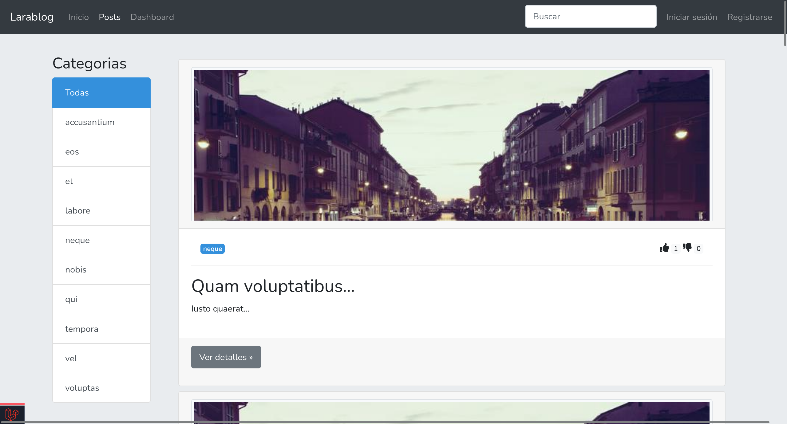
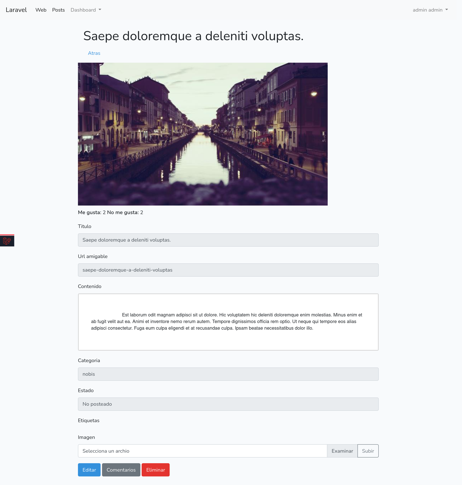
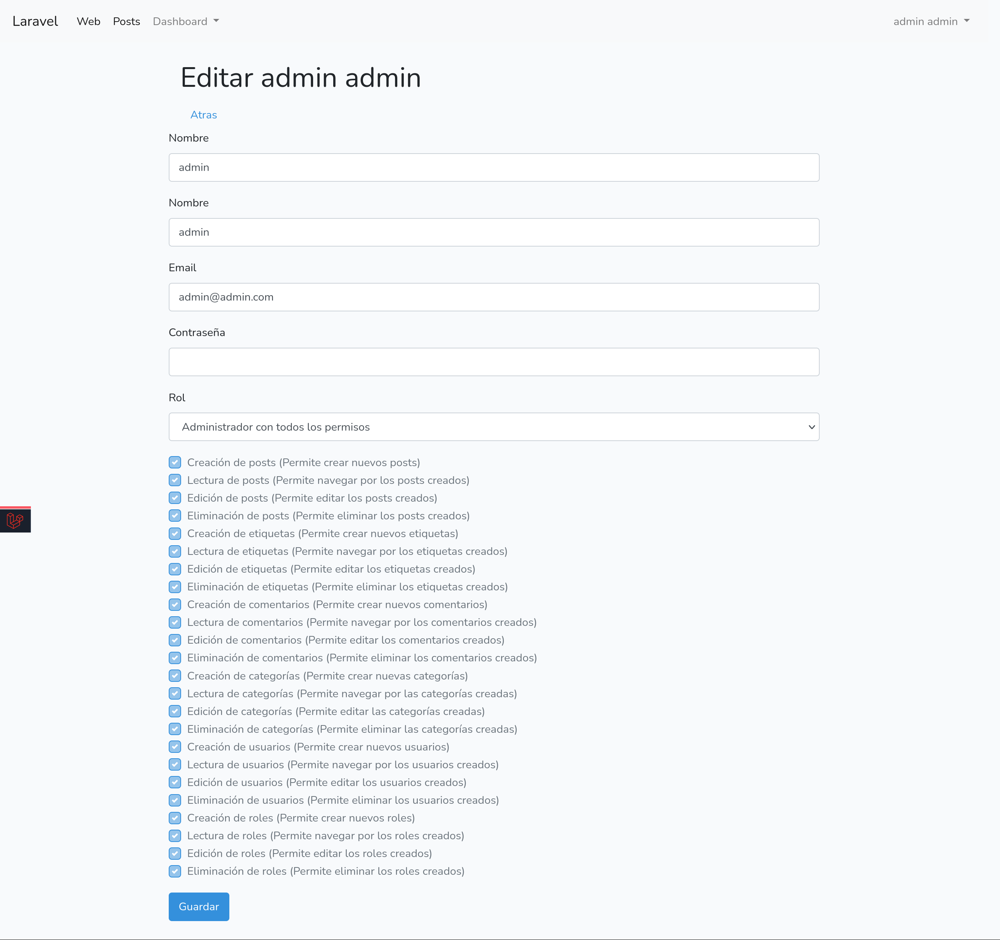
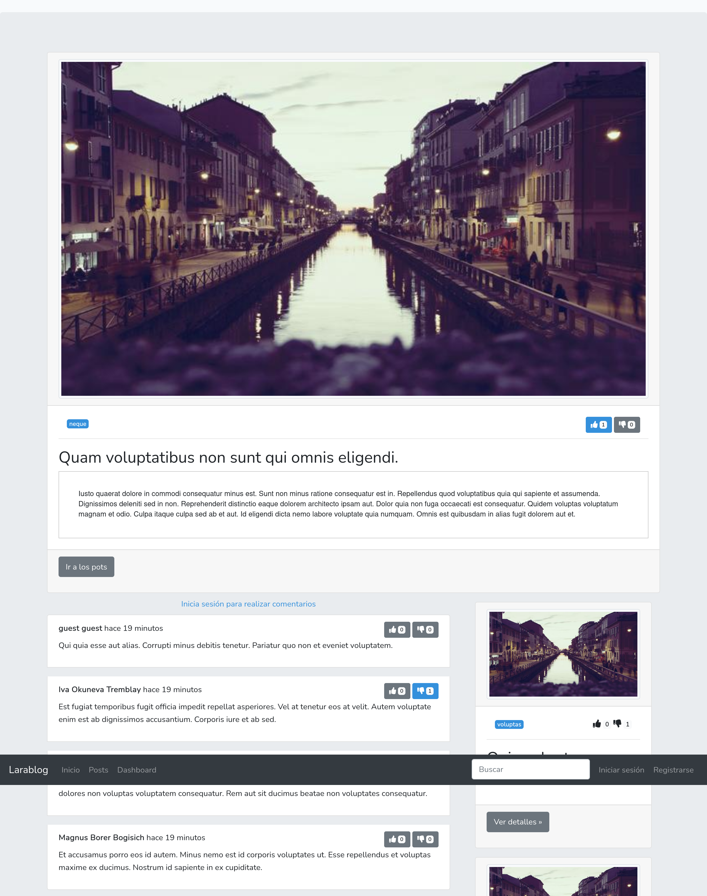
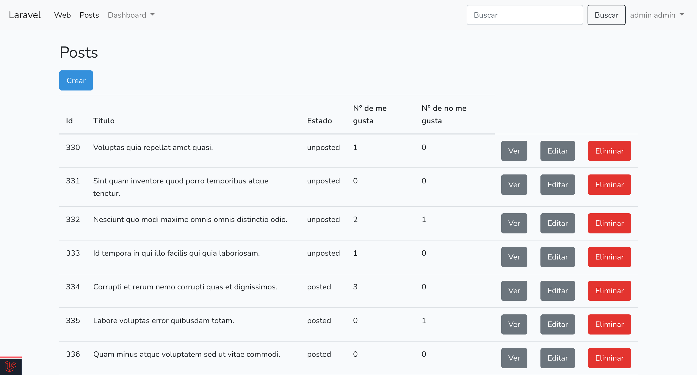
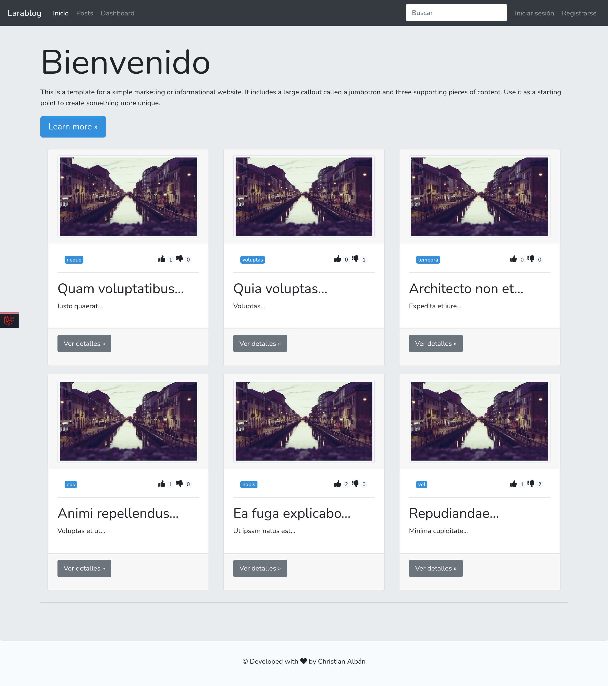

# Larablog

Larablog es una plataforma web que permite instalar un sistema completo para la administración de un Blog.

[TOC]

## Características

- Registro en línea de usuarios.

- Manejo de roles y permisos.

- Formularios con texto enriquecido.

- Sistema de votos y me gustas.

- Posibilidad de interacutar a través de comentarios.

## Requisitos mínimos
El sistema es una plataforma que utiliza tecnologías web modernas, por lo que requiere de los siguientes requisitos para funcionar correctamente:

- PHP v7.2 o superior
- Nginx v1.19 o superior
- Mysql 8.0.12 o superior
- Docker v20.10 o superior (Opcional si se desea ejecutar la imagen disponible)

Alternativamente se incluye un archivo Dockerfile que permite construir una imagen de Docker para poder ser lanzado desde un contenedor.

## Instalación

### Instalación Local

- Clonar el repositorio

```sh
git clone git@gitlab.com:chrisalban/larablog.git
cd larablog
```

- Instalar las dependencias

```shell
composer install
```

- Configurar el acceso a la base de datos y cliente de correo

- Configurar el archivo `.env`, el proyecto incluye un archivo de configuración de ejemplo `.env.example` del cual se puede copiar las configuraciones básicas.

```shell
cp .env.example .env
```

```
DB_CONNECTION=mysql
DB_HOST=127.0.0.1
DB_PORT=3306
DB_DATABASE=larablog //Colocar el nombre de la base de datos
DB_USERNAME=larablog_dev //Colocar el nombre de usuario de la base de datos
DB_PASSWORD=larablog_dev //Colocar la contraseña de la base de datos
```

Opcionalmente colocar el usuario y contraseña del cliente de correo electrónico

```
MAIL_MAILER=smtp
MAIL_HOST=smtp.mailtrap.io // Colocar el servidor del cliente de correo
MAIL_PORT=2525 // Colocar el puerto del cliente de correo
MAIL_USERNAME=null // Colocar el nombre de usuario del cliente de correo
MAIL_PASSWORD=null // Colocar la contraseña del cliente de correo
MAIL_ENCRYPTION=null // Colocar el tipo de encriptación
MAIL_FROM_ADDRESS=null
MAIL_FROM_NAME="${APP_NAME}"
```
- Ejecutar las migraciones y cargar la aplicación con datos de prueba

```shell
php artisan migrate --seed
```

- Generar la llave de la aplicación

```shell
php artisan key:generate
php artisan passport:install
```

**Nota**: Para que el proyecto funcione correctamente se debe configurar un host virtual apuntando a la carpeta `public` y agregarlo al archivo de redirecciones de host del sistema operativo, en caso de utilizar el servidor web Nginx se puede utilizar la configuración que se encuentra dentro de la carpeta `docker/nginx/cond.d`, y modificar el archivo `app.conf`.

```nginx
...
root /var/www/public # Cambiar la ruta a la ruta del proyecto
...
fastcgi_pass larablog:9000 # Cambiar por el inteprete de php ejemplo 127.0.0.1:9000 o unix:/var/run/php/php7.4-fpm.sock
```

### Instalación desde imagen de Docker

Para facilitar el despliegue y garantizar el correcto funcionamiento de la aplicación, hay disponible una imagen de Docker que contiene todas las configuraciones y dependencias necesarias del proyecto.

- Clonar el repositorio

```shell
git clone git@gitlab.com:chrisalban/larablog.git
cd larablog
```
- Copiar los archivos de configuración

```shell
cp docker-compose.example.yml docker-compose.yml
cp nginx.example.conf nginx.conf
```

- Ejecutar el archivo de configuración `docker-compose.yml` utilizando el comando `docker-compose`.

```shell
docker-compose up -d
```

- Se comenzará a construir la imagen y se ejecutarán todos los contenedores, se debe ingresar dentro del contenedor `larablog-php` para ejecutar la migración de la base de datos.

```shell
docker exec -it larablog-php bash
```

- Instalar las dependencias

```shell
composer install
```

**NOTA:** No se debe configurar la base de datos, se debe dejar la configuración que viene por defecto.

- Configurar el archivo `.env`, el proyecto incluye un archivo de configuración de ejemplo `.env.example` el cual se debe copiar.

```shell
cp .env.example .env
```

- Opcionalmente colocar el usuario y contraseña del cliente de correo electrónico

```
MAIL_MAILER=smtp
MAIL_HOST=smtp.mailtrap.io // Colocar el servidor del cliente de correo
MAIL_PORT=2525 // Colocar el puerto del cliente de correo
MAIL_USERNAME=null // Colocar el nombre de usuario del cliente de correo
MAIL_PASSWORD=null // Colocar la contraseña del cliente de correo
MAIL_ENCRYPTION=null // Colocar el tipo de encriptación
MAIL_FROM_ADDRESS=null
MAIL_FROM_NAME="${APP_NAME}"
```
- Dentro del contenedor ejecutar el comando de la migración.

```shell
php artisan migrate --seed
```

- Generar la llave de la aplicación

```shell
php artisan key:generate
php artisan passport:install
```

- Configurar el host virtual `/etc/hosts`, en el equipo, no en el contenedor
```shell
echo "192.168.0.242 larablog.test" | sudo tee -a /etc/hosts
```

### Usuarios por defecto

Después de ejecutar la migración con el modificador `--seed` para alimentar la base de datos con datos de prueba se podrá ingresar al sistema con las siguientes credenciales.

- **Administrador**: 

  Correo: admin@admin.com

  Contraseña: admin

- **Moderador**

  Correo: moderator@moderator.com

  Contraseña: moderator

- **Escritor**

  Correo: writer@writer.com

  Contraseña: writer
  
- **Invitado**

  Correo: guest@guest.com

  Contraseña: guest
  

## Capturas











